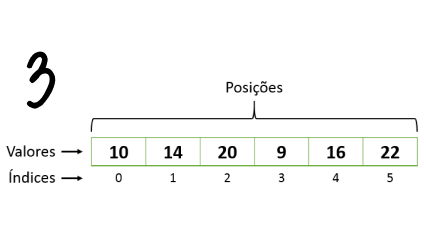

# impressão formatada

Ao trabalhar com vetores, muitas vezes é necessário formatar a saída de forma mais legível. Neste exercício, o objetivo é imprimir um vetor em um formato específico, utilizando uma função que realiza a formatação correta, separando os elementos por vírgulas e espaços.

Você deve implementar um programa que leia um vetor, armazene os valores e depois os exiba com uma formatação específica. O vetor deve ser impresso entre colchetes e os elementos separados por **"`,` "**. Se o vetor estiver vazio, deve ser exibido como `[]`.

### Entrada

- A primeira linha contém um número inteiro **N** representando a quantidade de elementos do vetor.
- A segunda linha contém **N** inteiros, separados por espaços, que devem ser inseridos no vetor.

### Saída

- Imprima o vetor carregado entre colchetes, com os elementos separados por espaços.

### Restrições

- **0 ≤ N ≤ 1000** (O vetor pode ter de 0 a 1000 elementos)
- Cada elemento será um número inteiro.

## Desafio

Implemente uma função que receba o vetor
  - Imprima o vetor formatado conforme descrito.
  - Ou retorne a string formatada do vetor, para que possa ser utilizada em outras partes do programa.

## Exemplos

<!-- tests tests.toml --limit 4 -->
<table><tr><th><code>Entrada</code></th><th><code>Saída</code></th></tr>
<!-- INPUT --><tr><td valign="top"><pre>
3
1 2 3
</pre></td>
<!-- OUTPUT --><td valign="top"><pre>
[1, 2, 3]
</pre></td></tr>
<!-- INPUT --><tr><td valign="top"><pre>
0
</pre></td>
<!-- OUTPUT --><td valign="top"><pre>
[]
</pre></td></tr>
<!-- INPUT --><tr><td valign="top"><pre>
1
6
</pre></td>
<!-- OUTPUT --><td valign="top"><pre>
[6]
</pre></td></tr>
<!-- INPUT --><tr><td valign="top"><pre>
5
1 2 3 4 5
</pre></td>
<!-- OUTPUT --><td valign="top"><pre>
[1, 2, 3, 4, 5]
</pre></td></tr>
</table>
<!-- end -->
