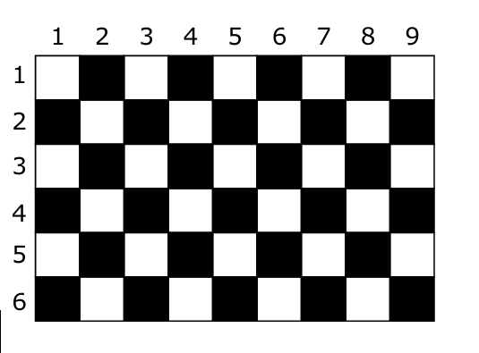

# Xadrez - OBI 2019 F1P1

## Contexto

No tabuleiro de xadrez, a casa na linha 1, coluna 1 (canto superior esquerdo) é sempre branca e as cores das casas se alternam entre branca e preta, de acordo com o padrão conhecido como... xadrez! Dessa forma, como o tabuleiro tradicional tem oito linhas e oito colunas, a casa na linha 8, coluna 8 (canto inferior direito) será também branca. Neste problema, entretanto, queremos saber a cor da casa no canto inferior direito de um tabuleiro com dimensões quaisquer: L linhas e C colunas. No exemplo da figura, para L = 6 e C = 9, a casa no canto inferior direito será preta!

### Entrada

- A primeira linha da entrada contém um inteiro L indicando o número de linhas do tabuleiro.
- A segunda linha da entrada contém um inteiro C representando o número de colunas.

### Saída

- Imprima uma linha na saída. A linha deve conter um inteiro, representando a cor da casa no canto inferior direito do tabuleiro:
  - 1, se for branca; e
  - 0, se for preta.

## Exemplos

<!-- tests tests.toml --limit 4 -->
<table><tr><th><code>Entrada</code></th><th><code>Saída</code></th></tr>
<!-- INPUT --><tr><td valign="top"><pre>
6
9
</pre></td>
<!-- OUTPUT --><td valign="top"><pre>
0
</pre></td></tr>
<!-- INPUT --><tr><td valign="top"><pre>
8
8
</pre></td>
<!-- OUTPUT --><td valign="top"><pre>
1
</pre></td></tr>
<!-- INPUT --><tr><td valign="top"><pre>
5
91
</pre></td>
<!-- OUTPUT --><td valign="top"><pre>
1
</pre></td></tr>
<!-- INPUT --><tr><td valign="top"><pre>
401
322
</pre></td>
<!-- OUTPUT --><td valign="top"><pre>
0
</pre></td></tr>
</table>
<!-- end -->
