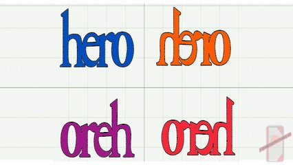

# Inverter String

- *"ra on odnalor at acopip ed oriehc a acopip"*
- *"Tá ficando doido menino?" Perguntou a mãe.*
- *"Que marmota é essa que você tá fazendo com meu LP da Xuxa?"*
- *"Mamãe, é que eu vi na internet que se tocarmos as músicas da Xuxa ao contrário saem umas mensagens sinistras!"*

Ajude Carlinhos a testar essa teoria.

Implemente um programa que, dada uma string, imprima a mesma string ao contrário.

### Entrada

- Uma frase de até **100** caracteres.

### Saída

- A frase invertida.

### Restrições

- A frase terá entre **1** e **100** caracteres.
- Apenas letras e espaços estarão na frase.

## Exemplos

<!-- tests tests.toml --limit 3 -->
<table><tr><th><code>Entrada</code></th><th><code>Saída</code></th></tr>
<!-- INPUT --><tr><td valign="top"><pre>
ra on odnalor at acopip ed oriehc o
</pre></td>
<!-- OUTPUT --><td valign="top"><pre>
o cheiro de pipoca ta rolando no ar
</pre></td></tr>
<!-- INPUT --><tr><td valign="top"><pre>
rahnos zaf em euq latsirc ed aul
</pre></td>
<!-- OUTPUT --><td valign="top"><pre>
lua de cristal que me faz sonhar
</pre></td></tr>
<!-- INPUT --><tr><td valign="top"><pre>
oacaroc ues on x mu ieuqram
</pre></td>
<!-- OUTPUT --><td valign="top"><pre>
marquei um x no seu coracao
</pre></td></tr>
</table>
<!-- end -->
