# QxcodeFup

<!--TOC_BEGIN-->
- [01. Operações: Impressão formatada](#01-operações-impressão-formatada)
- [02. Operações: Biblioteca Math](#02-operações-biblioteca-math)
- [03. Seleção: Manipulação](#03-seleção-manipulação)
- [04. Selação: Biblioteca Math](#04-selação-biblioteca-math)
- [05. Seleção: Lógica](#05-seleção-lógica)
- [06. Seleção: Operador de módulo](#06-seleção-operador-de-módulo)
- [07. Seleção: Intervalos](#07-seleção-intervalos)
- [08. Seleção: Busca e Contagem](#08-seleção-busca-e-contagem)
- [09. Seleção: Conversão](#09-seleção-conversão)
- [10. Laço: Básico](#10-laço-básico)
- [11. Técnicas de controle](#11-técnicas-de-controle)
- [12. Laço: Math](#12-laço-math)
- [13. Vetores: Busca](#13-vetores-busca)
- [14. Vetores: Contagem](#14-vetores-contagem)
- [15. Vetores: Conversão](#15-vetores-conversão)
- [16. Vetores: Manipulação](#16-vetores-manipulação)
- [17. Vetores: Proximidade](#17-vetores-proximidade)
- [18. Vetores: Ordenação](#18-vetores-ordenação)
- [19. Vetores: Lógica](#19-vetores-lógica)
- [20. Vetores: Math](#20-vetores-math)
- [21. Strings I](#21-strings-i)
- [22. Strings II](#22-strings-ii)
- [23. Strings III](#23-strings-iii)
- [24. Strings IV](#24-strings-iv)
- [25. Matrizes I](#25-matrizes-i)
- [26. Matrizes II](#26-matrizes-ii)
- [27. Ponteiros](#27-ponteiros)
- [28. Recursão](#28-recursão)
- [29. Structs](#29-structs)
<!--TOC_END-->

```
Conteúdo sugeridos
- instalando o mingw e vscode
- tipos de dados básicos: `bool, int, float, char, const char *`
- operadores aritméticos: `+ - * / %`
- lendo e escrevendo variáveis: scanf, printf, puts, getchar
- uso avançado do scanf
- maldição da leitura do char, lendo ou ignorando whitespaces
- lendo errado a entrada, limpando o buffer
- como funciona o buffer de entrada
- utilizando funções da biblioteca math.h
- debugando
```

## 01. Operações: Impressão formatada
\________________ | \______________________
----------------- | -----------------------
 | [@024 L1 - Divisão Inteira e Quebrada](base/024/Readme.md)
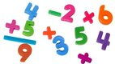 | [@000 L1 - Operações básicas](base/000/Readme.md)
 | [@011 L2 - Formatando data](base/011/Readme.md)

## 02. Operações: Biblioteca Math
\________________ | \______________________
----------------- | -----------------------
 | [@002 L2 - Pintando a casa](base/002/Readme.md)
 | [@003 L2 - Opala bebedor](base/003/Readme.md)
 | [@196 L2 - Comprando TV parcelado](base/196/Readme.md)
 | [@004 L3 - Mete bala](base/004/Readme.md)


```
- Funções
    - recebendo e retornando básicos
    - retorno de função: retorno default e returnos parciais ao invés de elses
- Estruturas de Seleção
    - Indentação, estruturas básicas e uso de operadores lógicos de corte
    - if, else, else if
    - Operadores lógicos: `&&, ||, !`
    - Operadores relacionais: `==, !=, >, <, >=, <=`
    - Operador ternário
```

## 03. Seleção: Manipulação
\________________________ | \___________________________________________________________
------------------------- | ------------------------------------------------------------
 | [@015 L1 - Calculadora Numérica](base/015/Readme.md)
 | [@155 L1 - Plantação de Morangos](base/155/Readme.md)
 | [@151 L1 - Impedido!](base/151/Readme.md)
 | [@026 L1 - Positivo, Nulo ou Negativo?](base/026/Readme.md)
 | [@031 L2 - Fiquei de final](base/031/Readme.md)
 | [@040 L2 - Está Trabalhando ou Não!](base/040/Readme.md)
 | [@035 L2 - Drone de Entrega - OBI 2017 - Fase 1](base/035/Readme.md)

## 04. Selação: Biblioteca Math
\________________________ | \___________________________________________________________
------------------------- | ------------------------------------------------------------
 | [@018 L2 - Arredondar](base/018/Readme.md)
 | [@030 L2 - Mercantil V1 - Quem chega mais perto](base/030/Readme.md)
 | [@039 L2 - Mercantil V2 - Maior ou Menor](base/039/Readme.md)
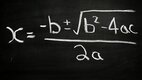 | [@001 L2 - Bhaskara](base/001/Readme.md)

## 05. Seleção: Lógica
\________________________ | \___________________________________________________________
------------------------- | ------------------------------------------------------------
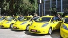 | [@157 L1 - Frota de Táxi - OBI 2005](base/157/Readme.md)
 | [@014 L1 - Quantos são iguais?](base/014/Readme.md)
 | [@156 L2 - Jogo de par ou ímpar - OBI 2016 - F1P1](base/156/Readme.md)
 | [@194 L2 - Nota cortada - OBI 2019 F1P1](base/194/Readme.md)
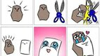 | [@023 L2 - Jokenpo das tartarugas!](base/023/Readme.md)
 | [@020 L2 - Zerinho ou Um!](base/020/Readme.md)


## 06. Seleção: Operador de módulo
\________________________ | \___________________________________________________________
------------------------- | ------------------------------------------------------------
 | [@062 L2 - Angulo Cartesiano](base/062/Readme.md)
 | [@025 L1 - Ambos Divisíveis](base/025/Readme.md)
 | [@022 L2 - Teleférico - OBI 2017 - Fase 1](base/022/Readme.md)
 | [@195 L2 - Xadrez OBI 2019 F1P1](base/195/Readme.md)
 | [@193 L2 - Dominó - OBI 2019 F1PJ](base/193/Readme.md)
 | [@005 L2 - Ladrão de Goiabas](base/005/Readme.md)
 | [@028 L2 - Cabeça da cobra](base/028/Readme.md)
 | [@016 L2 - Volta de 360 graus - Retirando os loops](base/016/Readme.md)
 | [@019 L2 - Game 10 - OBI 2017 - Fase 1 - Universitário](base/019/Readme.md)
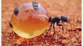 | [@034 L3 - Formiga da bundona](base/034/Readme.md)
 | [@006 L3 - Zerinho ou um americano - Decifrando a fórmula](base/006/Readme.md)
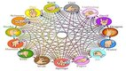 | [@037 L3 - Jokenpo 15](base/037/Readme.md)


## 07. Seleção: Intervalos
\________________________ | \___________________________________________________________
------------------------- | ------------------------------------------------------------
 | [@021 L2 - Aumento de Salário](base/021/Readme.md)
 | [@032 L2 - Bolada na fuça](base/032/Readme.md)
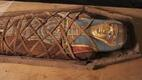 | [@183 L2 - Criança ou Múmia](base/183/Readme.md)

## 08. Seleção: Busca e Contagem
\________________________ | \___________________________________________________________
------------------------- | ------------------------------------------------------------
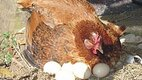 | [@017 L2 - Maior ovo](base/017/Readme.md)
 | [@192 L2 - A idade de Dona Mônica - OBI 2019 - F1PJ](base/192/Readme.md)
 | [@029 L2 - Quiz do Harry Potter](base/029/Readme.md)
 | [@036 L3 - Morre o do meio](base/036/Readme.md)
 | [@033 L3 - Professor Bonzinho](base/033/Readme.md)

## 09. Seleção: Conversão
\________________________ | \___________________________________________________________
------------------------- | ------------------------------------------------------------
 | [@038 L2 - Próximo segundo](base/038/Readme.md)
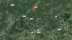 | [@027 L2 - Adedonha](base/027/Readme.md)
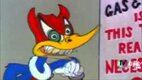 | [@043 L3 - Horas de sono](base/043/Readme.md)


```
- Seleção: if, else, else if
- Controle: for, while, do while
- Controle de laço: break, continue
- Funções com returns parciais
```

## 10. Laço: Básico
\________________________ | \___________________________________________________________
------------------------- | ------------------------------------------------------------
 | [@013 L1 - Sapatos para 3](base/013/Readme.md)
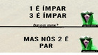 | [@045 L1 - Soma dos pares](base/045/Readme.md)
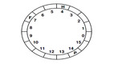 | [@053 L2 - Fuga em helicóptero - OBI 2016](base/053/Readme.md)
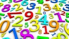 | [@046 L2 - Jogo da Concentração](base/046/Readme.md)

## 11. Técnicas de controle
\________________________ | \___________________________________________________________
------------------------- | ------------------------------------------------------------
 | [@047 L2 - Ônibus lotado](base/047/Readme.md)
 | [@049 L2 - Sapinho 1 no Poço](base/049/Readme.md)
 | [@059 L3 - Sapinho 2 morrendo no poço](base/059/Readme.md)
 | [@065 L3 - Sapinho 3 matemático](base/065/Readme.md)
 | [@050 L2 - Castelos de Cubos](base/050/Readme.md)
 | [@054 L3 - Quebrador de Copos](base/054/Readme.md)

## 12. Laço: Math
\________________________ | \___________________________________________________________
------------------------- | ------------------------------------------------------------
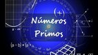 | [@090 L2 - Primo](base/090/Readme.md)
 | [@189 L2 - Fatores de um número](base/189/Readme.md)
 | [@052 L3 - Sopa de coelho?](base/052/Readme.md)
 | [@160 L3 - Somatório de Fibonacci](base/160/Readme.md)
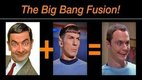 | [@066 L2 - Spok Palíndromo](base/066/Readme.md)
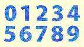 | [@064 L3 - Conta Dígitos](base/064/Readme.md)


## 13. Vetores: Busca
\________________________ | \___________________________________________________________
------------------------- | ------------------------------------------------------------
 | [@056 L1 - Calça apertada](base/056/Readme.md)
 | [@060 L1 - Casamento](base/060/Readme.md)
 | [@051 L3 - Pedra na lua](base/051/Readme.md)
 | [@058 L2 - Busca Intervalada](base/058/Readme.md)
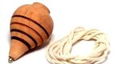 | [@100 L3 - Pião na rodinha](base/100/Readme.md)

## 14. Vetores: Contagem
\________________________ | \___________________________________________________________
------------------------- | ------------------------------------------------------------
 | [@055 L1 - Contagem](base/055/Readme.md)
 | [@048 L2 - Cabo de Guerra Jedi](base/048/Readme.md)
 | [@057 L2 - Revolta em Portugal](base/057/Readme.md)
 | [@072 L2 - Soldados PMG!](base/072/Readme.md)
 | [@077 L3 - Mercantil V3 - Muitas rodadas](base/077/Readme.md)

## 15. Vetores: Conversão
\________________________ | \___________________________________________________________
------------------------- | ------------------------------------------------------------
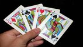 | [@101 L2 - Mostrar cartas](base/101/Readme.md)
 | [@063 L3 - Blackjack 21!](base/063/Readme.md)
 | [@188 L3 - Devolvendo o troco](base/188/Readme.md)
 | [@082 L3 - Vetor para inteiro](base/082/Readme.md)

## 16. Vetores: Manipulação
\________________________ | \___________________________________________________________
------------------------- | ------------------------------------------------------------
 | [@061 L2 - Invertendo vetor](base/061/Readme.md)
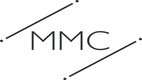 | [@091 L2 - MMC](base/091/Readme.md)
 | [@068 L2 - Fila do RU](base/068/Readme.md)
 | [@186 L2 - Linha de inteiros](base/186/Readme.md)
 | [@161 L3 - Vivo ou Morto - OBI 2005](base/161/Readme.md)
 | [@081 L3 - Decompor um inteiro](base/081/Readme.md)
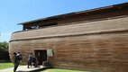 | [@087 L3 - Arca: Quantos casais](base/087/Readme.md)
 | [@084 L3 - Arca: Exemplares](base/084/Readme.md)

## 17. Vetores: Proximidade
\________________________ | \___________________________________________________________
------------------------- | ------------------------------------------------------------
 | [@067 L2 - Queda de dominós](base/067/Readme.md)
 | [@078 L2 - Jogo do Avesso](base/078/Readme.md)
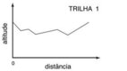 | [@136 L2 - Trilhas Easy- OBI 2005](base/136/Readme.md)
 | [@158 L3 - Trilhas - OBI 2005](base/158/Readme.md)
 | [@071 L3 - Parkour](base/071/Readme.md)
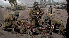 | [@085 L3 - Perto do médico](base/085/Readme.md)
 | [@079 L3 - Jogo do Avesso V2](base/079/Readme.md)

## 18. Vetores: Ordenação
\________________________ | \___________________________________________________________
------------------------- | ------------------------------------------------------------
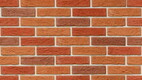 | [@198 L1 - Paredes](base/198/Readme.md)
 | [@073 L2 - Batida Policial](base/073/Readme.md)
 | [@200 L2 - Vacina](base/200/Readme.md)
 | [@088 L2 - Mediana](base/088/Readme.md)
 | [@197 L2 - Indices](base/197/Readme.md)

## 19. Vetores: Lógica
\________________________ | \___________________________________________________________
------------------------- | ------------------------------------------------------------
 | [@075 L3 - Abastecimento de água](base/075/Readme.md)
 | [@083 L3 - Batráquios](base/083/Readme.md)
 | [@080 L3 - Figurinhas](base/080/Readme.md)
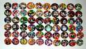 | [@086 L3 - Tazos](base/086/Readme.md)
 | [@010 L3 - Bolinhas viciadas](base/010/Readme.md)
 | [@070 L3 - Cabeças vão rolar](base/070/Readme.md)
 | [@074 L3 - Botas Trocadas - OBI 2017](base/074/Readme.md)
 | [@076 L3 - O segredo do Cofre - OBI 2017](base/076/Readme.md)
 | [@042 L3 - Chefe Nervoso - OBI 2021](base/042/Readme.md)

## 20. Vetores: Math
\________________________ | \___________________________________________________________
------------------------- | ------------------------------------------------------------
 | [@138 L3 - Permutação](base/138/Readme.md)
 | [@008 L3 - Senhas](base/008/Readme.md)
 | [@190 L4 - Maiores Palíndromos](base/190/Readme.md)


## 21. Strings I
\________________________ | \___________________________________________________________
------------------------- | ------------------------------------------------------------
 | [@173 L1 - Eribelton e a Ascologia V1 - Somar Asc](base/173/Readme.md)
 | [@092 L1 - LP da Xura - Inverter String!](base/092/Readme.md)
 | [@104 L1 - Maiúsculo, Minusculo e Dígito!](base/104/Readme.md)
 | [@177 L1 - Marileuza e as Alcaparras - Contar Ocorrencias!](base/177/Readme.md)
 | [@176 L1 - Substring na decoração - Obter Substrings!](base/176/Readme.md)
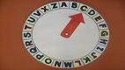 | [@174 L1 - Valdiskey e a cifra V1!](base/174/Readme.md)
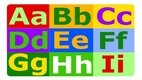 | [@095 L2 - Avestruz com Alcaparras](base/095/Readme.md)
 | [@096 L2 - Contar Leds](base/096/Readme.md)
 | [@126 L2 - Crushômetro](base/126/Readme.md)
 | [@109 L2 - Eribelton e a Ascologia V2](base/109/Readme.md)
 | [@097 L2 - Gagueira V1 - Duplicar Palavras](base/097/Readme.md)
 | [@093 L2 - Gritando em Caixa Alta](base/093/Readme.md)

## 22. Strings II
\________________________ | \___________________________________________________________
------------------------- | ------------------------------------------------------------
 | [@180 L2 - Guerra Civil no Universo Marvel](base/180/Readme.md)
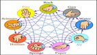 | [@089 L2 - Mega Jokenpo!](base/089/Readme.md)
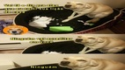 | [@111 L2 - Meu cachorro comeu minha tarefa](base/111/Readme.md)
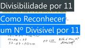 | [@125 L2 - Numerão Divisível por 11](base/125/Readme.md)
 | [@110 L2 - Organizando Ru - Homens e Mulheres!](base/110/Readme.md)
 | [@181 L2 - Somando numeros](base/181/Readme.md)
 | [@106 L2 - Valdiskley e a cifra V2!](base/106/Readme.md)
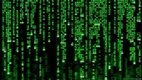 | [@094 L2 - Vogais e Consoantes](base/094/Readme.md)
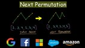 | [@163 L4 - Permutação Lexograficamente Final de Fichas](base/163/Readme.md)
 | [@127 L3 - Amo a Amora meu Amor](base/127/Readme.md)
 | [@124 L3 - Conversa de Traficantes](base/124/Readme.md)
 | [@113 L3 - Eribelton e a Ascologia V3](base/113/Readme.md)

## 23. Strings III
\________________________ | \___________________________________________________________
------------------------- | ------------------------------------------------------------
 | [@099 L3 - Francês é Fresco](base/099/Readme.md)
 | [@120 L3 - Gansos Gamados](base/120/Readme.md)
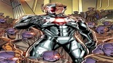 | [@117 L3 - Identificando Ultrons V2](base/117/Readme.md)
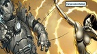 | [@118 L3 - Aniquilando Ultrons V3](base/118/Readme.md)
 | [@108 L3 - Identificando elementos](base/108/Readme.md)
 | [@178 L3 - Jack Sparrow e o Beijinho](base/178/Readme.md)
 | [@098 L3 - Jason e Krueguer](base/098/Readme.md)
 | [@152 L3 - Letras Ordenadas](base/152/Readme.md)
 | [@119 L3 - Matéria e Antimatéia](base/119/Readme.md)
 | [@114 L3 - MeU WoRd QuEbRoU](base/114/Readme.md)
 | [@102 L3 - Meu cachorro comeu minha tarefa V2](base/102/Readme.md)
 | [@115 L3 - Máquina de Datilografar Quebrada](base/115/Readme.md)

## 24. Strings IV
\________________________ | \___________________________________________________________
------------------------- | ------------------------------------------------------------
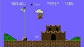 | [@121 L3 - Mário e o Assassins Creed](base/121/Readme.md)
 | [@122 L3 - Nao se bububula - Gagueira V2!](base/122/Readme.md)
 | [@179 L3 - Prof Muquirana - Busca máximo por critério](base/179/Readme.md)
 | [@112 L3 - Rocicleia e o Locioreca - Anagramas!](base/112/Readme.md)
 | [@116 L3 - Roda Roda Jequiti](base/116/Readme.md)
 | [@175 L3 - Separando a partir de tokens](base/175/Readme.md)
 | [@103 L3 - Separe Pneumatocito - Separação de Palavras!](base/103/Readme.md)
 | [@123 L3 - Sorvete suor casaca chicletes - Letras em Comum!](base/123/Readme.md)
 | [@107 L3 - Valdiskley e a Cifra v3!](base/107/Readme.md)
 | [@105 L3 - Valdiskley e cifras históricas!](base/105/Readme.md)
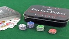 | [@162 L3 - Mini-Poker - OBI2005](base/162/Readme.md)
 | [@041 L3 - Criptografia](base/041/Readme.md)


## 25. Matrizes I
\________________________ | \___________________________________________________________
------------------------- | ------------------------------------------------------------
 | [@130 L2 - Bingo!](base/130/Readme.md)
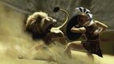 | [@012 L2 - Deu a louca no Imperador!](base/012/Readme.md)
 | [@191 L2 - Coluna de Valor Maior](base/191/Readme.md)
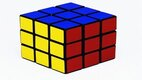 | [@134 L2 - Quadrado Mágico](base/134/Readme.md)
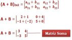 | [@128 L2 - Soma de elementos de em uma matriz](base/128/Readme.md)
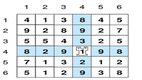 | [@153 L3 - Torre - OBI 2015 - Fase 2 - Nível 1](base/153/Readme.md)
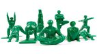 | [@133 L2 - Soldados em Posição](base/133/Readme.md)

## 26. Matrizes II
\________________________ | \___________________________________________________________
------------------------- | ------------------------------------------------------------
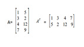 | [@131 L2 - Matriz Simétrica](base/131/Readme.md)
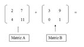 | [@150 L2 - Soma de matrizes](base/150/Readme.md)
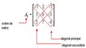 | [@132 L2 - Subdiagonais](base/132/Readme.md)
 | [@135 L3 - Jogo da vida](base/135/Readme.md)
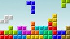 | [@007 L3 - Tetris (Fazendo a peça cair)](base/007/Readme.md)
 | [@129 L3 - Campo Minado](base/129/Readme.md)
 | [@159 L3 - Campo de Minhocas - OBI 2005](base/159/Readme.md)
 | [@154 L3 - Código - OBI 2015 - Fase 2 - Nível Júnior](base/154/Readme.md)


## 27. Ponteiros
\________________________ | \___________________________________________________________
------------------------- | ------------------------------------------------------------
 | [@009 L2 - Imprimir vetor formatado](base/009/Readme.md)
 | [@139 L4 - A Porta Matemática](base/139/Readme.md)
 | [@147 L1 - Duelo](base/147/Readme.md)
 | [@143 L1 - Troca de valores de variáveis](base/143/Readme.md)
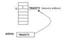 | [@144 L2 - Função que retorna vários valores por referência](base/144/Readme.md)
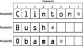 | [@142 L2 - Vetor de strings com variados tamanhos](base/142/Readme.md)

## 28. Recursão
\________________________ | \___________________________________________________________
------------------------- | ------------------------------------------------------------
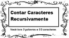 | [@145 L2 - Contando ocorrências](base/145/Readme.md)
 | [@141 L2 - Números de Fibonacci](base/141/Readme.md)
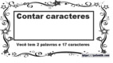 | [@140 L3 - Contando caracteres recursivamente](base/140/Readme.md)
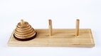 | [@146 L3 - Torres de Hanoi](base/146/Readme.md)

## 29. Structs
\________________________ | \___________________________________________________________
------------------------- | ------------------------------------------------------------
 | [@148 L1 - Expressão](base/148/Readme.md)
 | [@149 L1 - Operações](base/149/Readme.md)
 | [@199 L2 - Pizza](base/199/Readme.md)
 | [@201 L2 - Comparar Data](base/201/Readme.md)
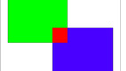 | [@069 L2 - Retângulo](base/069/Readme.md)
 | [@202 L2 - Ponto perto](base/202/Readme.md)
 | [@187 L2 - Jogo da cobrinha](base/187/Readme.md)
 | [@184 L3 - Secundaristas](base/184/Readme.md)
 | [@182 L3 - Mulher mais idosa](base/182/Readme.md)

