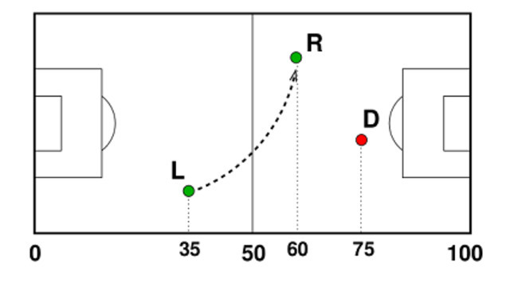
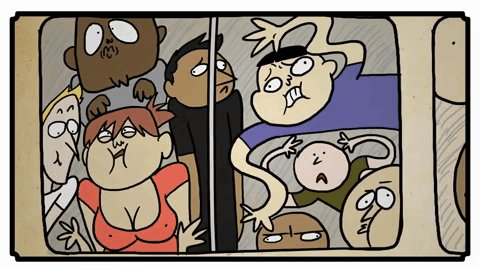
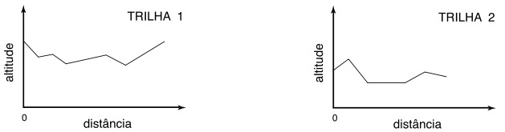
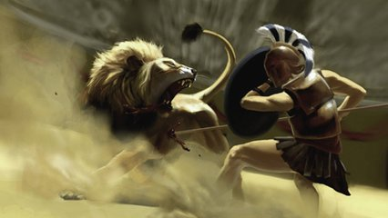
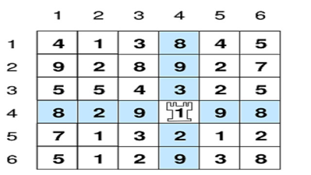
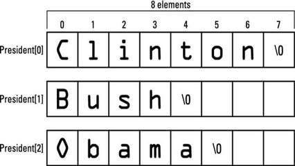
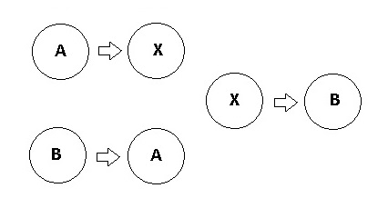

## @qxcode

### 01_ope

@011 L1 - Formatando data (Zeros à esquerda)|@000 L1 - Operações básicas (Imprimindo float formatado)|@003 L2 - Opala bebedor (Cálculo de desempenho)|@002 L2 - Pintando a casa (Calculando a área do triângulo)
-|-|-|-
|||

@005 L3 - Ladrão de Goiabas (Contando viagens)|@004 L3 - Mete bala (Distância entre dois pontos)|@006 L3 - Zerinho ou um americano (Calcule o vencedor)|-
-|-|-|-
|||

### 02_sel

@025 L1 - Ambos Divisíveis|@062 L1 - Angulo Cartesiano - Operador Modular|@015 L1 - Calculadora Numérica|@024 L1 - Divisão Inteira e Quebrada
-|-|-|-
|||

@151 L1 - OBI 2015 - Fase 2 - Nível 1 - Impedido!|@156 L1 - OBI 2016 - Fase1 - Nível 1 - Jogo de par ou ímpar|@155 L1 - OBI 2016 - Fase1 - Nível 1 - Plantação de Morangos!|@026 L1 - Positivo, Nulo ou Negativo?
-|-|-|-
|||

@038 L2 - A hora do próximo segundo|@027 L2 - Adedonha na Califórnia|@018 L2 - Arrendondar|@021 L2 - Aumento de Salário
-|-|-|-
|||

@032 L2 - Bolada na fuça|@028 L2 - Cadê a cabeça da cobra|@183 L2 - Criança, Adulto, Idoso, Múmia|@031 L2 - Fiquei de final
-|-|-|-
|||

@030 L2 - Mercantil V1 - Quem chega mais perto|@039 L2 - Mercantil V2 - Maior ou Menor|@035 L2 - OBI 2017 - Fase 1 - Drone de Entrega|@022 L2 - OBI 2017 - Fase 1 - Teleférico
-|-|-|-
|||

@019 L2 - OBI 2017 - Fase 1 - Universitário - Game 10|@017 L2 - Ovos de galinha (Procurando o Maior valor)|@014 L2 - Quantos são iguais? (Contando Repetidos)|@029 L2 - Quiz do Harry Potter
-|-|-|-
|||

@020 L2 - Zerinho ou Um!|@043 L3 - Dorme Tarde Acordar Cedo!|@040 L3 - Está Trabalhand ou Não!|@034 L3 - Formiga da bundona
-|-|-|-
|||

@157 L3 - Frota de Táxi - OBI 2005|@037 L3 - Jokenpo 15|@023 L3 - Jokenpo das tartarugas!|@036 L3 - Morre o do meio
-|-|-|-
|||

@033 L3 - Professor Bonzinho|@042 L3 - Rufus e Ordenação!|@041 L3 - Rufus e Par ou Ímpar!|@001 L3 - Sai fora Bhaskara (Cálculo de raízes)
-|-|-|-
|||

### 03_rep

@056 L1 - Calça Zeze de Camargo - Mínimo|@013 L1 - Dividindo pares de sapatos pra três|@055 L1 - Quantos Ultrons você vê - Contar Elemento|@044 L1 - Somatório V2
-|-|-|-
|||

@045 L1 - Zero é par - Somatório de Pares!|@058 L2 - Busca Intervalada|@048 L2 - Cabo de Guerra Jedi|@050 L2 - Castelos de Cubos
-|-|-|-
|||

@046 L2 - Jogo da Concentração|@057 L2 - Revolta em Portugal|@049 L2 - Sapinho 1 no Poço|@136 L2 - Trilhas - OBI 2005 - (Modo Easy)
-|-|-|-
|||

@016 L2 - Volta de 360 graus (Retirando os loops)|@047 L2 - Ônibus lotado|@051 L3 - Arremesso de pedra na lua|@160 L3 - Bafo - OBI 2005
-|-|-|-
|||

@063 L3 - Blackjack 21!|@064 L3 - Conta Dígitos|@052 L3 - Hoje tem sopa de coelho?|@053 L3 - OBI 2016 - Fuga em helicóptero
-|-|-|-
|||

@054 L3 - Quebrador de Copos|@059 L3 - Sapinho 2 morrendo no poço|@065 L3 - Sapinho 3 matemático não morrendo no poço|@066 L3 - Spok Palíndromo
-|-|-|-
|||

@158 L3 - Trilhas - OBI 2005|@161 L3 - Vivo ou Morto - OBI 2005|-|-
-|-|-|-
|||

### 04_vet

@060 L1 - Joelison Fernandes - Soma do maior e menor!|@061 L2 - Capoeira invertendo vetor!|@078 L2 - Jogo do Avesso|@091 L2 - MMC
-|-|-|-
|||

@101 L2 - Mostrar mão de cartas (Imprimir vetor formatado)|@068 L2 - Organizando a fila do RU - Separar Pares e Ímpares!|@090 L2 - Primo|@067 L2 - Queda de dominós
-|-|-|-
|||

@072 L2 - Soldados Pequenos e Grandes!|@075 L3 - Abastecimento de água|@083 L3 - Anfíbios e Batráquios - Está contido|@082 L3 - As unhas de Luiza - Vetor para inteiro
-|-|-|-
|||

@080 L3 - Baruel Ruel trocando figurinhas!|@073 L3 - Batida Policial - Ordenando vetores|@010 L3 - Bolinhas viciadas(contagem de repetições)|@070 L3 - Cabeças vão rolar
-|-|-|-
|||

@086 L3 - Coleção de Tazos - Quantos se repetem mais|@085 L3 - Exército - Perto da morte|@008 L3 - Força Bruta (Gerando próxima combinação)|@100 L3 - Jogando pião na rodinha
-|-|-|-
|||

@079 L3 - Jogo do Avesso V2|@081 L3 - Loucura de Marquinhos - Decompor um inteiro|@139 L3 - MMC de vários números.|@077 L3 - Mercantil V3 - Muitas rodadas
-|-|-|-
|||

@162 L3 - Mini-Poker - OBI2005|@071 L3 - Mário e o Assassins Creed - Parkour|@074 L3 - OBI 2017 - Fase 1 - Botas Trocadas|@076 L3 - OBI 2017 - Fase 1 - O segredo do Cofre
-|-|-|-
|||

@088 L3 - Se fosse a mediana eu tinha passado!|@069 L3 - Zoo quantas especies!|@087 L3 - Zoologico Entrando na Arca de Noé|@084 L3 - Zoologico Um animal de cada tipo!
-|-|-|-
|||

### 05_str

@173 L1 - Eribelton e a Ascologia V1 - Somar Asc|@092 L1 - LP da Xura - Inverter String!|@104 L1 - Maiúsculo, Minusculo e Dígito!|@177 L1 - Marileuza e as Alcaparras - Contar Ocorrencias!
-|-|-|-
|||

@176 L1 - Substring na decoração - Obter Substrings!|@174 L1 - Valdiskey e a cifra V1!|@095 L2 - Avestruz com Alcaparras - Contar Maiusculas e Minusculas!|@096 L2 - Contar Leds
-|-|-|-
|||

@126 L2 - Crushômetro|@109 L2 - Eribelton e a Ascologia V2 - Buscando a perfeição|@097 L2 - Gagueira V1 - Duplicar Palavras|@093 L2 - Gritando em Caixa Alta - Invertendo o Case da frase!
-|-|-|-
|||

@180 L2 - Guerra Civil no Universo Marvel|@089 L2 - Mega Jokenpo!|@111 L2 - Meu cachorro comeu minha tarefa - Retirar espaços|@125 L2 - Numerão Divisível por 11
-|-|-|-
|||

@110 L2 - Organizando Ru - Homens e Mulheres!|@181 L2 - Somando numeros|@106 L2 - Valdiskley e a cifra V2!|@094 L2 - Vogais e Consoantes - Identificação e Montagem!
-|-|-|-
|||

@127 L3 - Amo a Amora meu Amor - Contar Substrings!|@118 L3 - Aniquilando Ultrons V3|@124 L3 - Conversa de Traficantes - Substituições de substrings|@113 L3 - Eribelton e a Ascologia V3 - Busca do mínimo
-|-|-|-
|||

@099 L3 - Francês é Fresco - Juntar palavras|@120 L3 - Gansos Gamados - Verificar ordenação da frase!|@117 L3 - Identificando Ultrons V2|@108 L3 - Identificando elementos
-|-|-|-
|||

@178 L3 - Jack Sparrow e o Beijinho - Alternar Case|@098 L3 - Jason e Krueguer - busca de maior ocorrencia|@119 L3 - Matéria e Antimatéia - Colisão entre palavras!|@114 L3 - MeU WoRd QuEbRoU - Formatação de Case!
-|-|-|-
|||

@102 L3 - Meu cachorro comeu minha tarefa V2 - Retirar espaços duplicados|@115 L3 - Máquina de Datilografar Quebrada|@121 L3 - Mário e o Assassins Creed - Cenário|@122 L3 - Nao se bububula - Gagueira V2!
-|-|-|-
|||

@152 L3 - OBI 2015 - Fase 2 - Nível 1 - Letras|@179 L3 - Prof Muquirana - Busca máximo por critério|@112 L3 - Rocicleia e o Locioreca - Anagramas!|@116 L3 - Roda Roda Jequiti - Jogo da Forca!
-|-|-|-
|||

@175 L3 - Separando a partir de tokens|@103 L3 - Separe Pneumatocito - Separação de Palavras!|@123 L3 - Sorvete suor casaca chicletes - Letras em Comum!|@107 L3 - Valdiskley e a Cifra v3!
-|-|-|-
|||

@105 L3 - Valdiskley e cifras históricas!|-|-|-
-|-|-|-
|||

### 06_mat

@130 L2 - Bingo!|@012 L2 - Deu a louca no Imperador!|@134 L2 - Quadrado Mágico|@133 L2 - Soldados em Posição
-|-|-|-
|||

@128 L2 - Soma de elementos de em uma matriz|@150 L2 - Soma de matrizes|@129 L3 - Campo Minado|@159 L3 - Campo de Minhocas - OBI 2005
-|-|-|-
|||

@135 L3 - Jogo da vida|@131 L3 - Matriz Simétrica|@153 L3 - OBI 2015 - Fase 2 - Nível 1 - Torre|@154 L3 - OBI 2015 - Fase 2 - Nível Júnior - Código
-|-|-|-
|||

@132 L3 - Subdiagonais|@007 L3 - Tetris (Fazendo a peça cair)|-|-
-|-|-|-
|||

### 07_dic

@148 L1 - Expressão|@149 L1 - Operações|@182 L3 - Mulher mais idosa|-
-|-|-|-
|||

### 07_rec

@145 L2 - Contando caracteres recursivamente|@141 L2 - Números de Fibonacci|@140 L3 - Contando caracteres recursivamente|@146 L3 - Torres de Hanoi
-|-|-|-
|||

### 09_alo

@142 L2 - Vetor de strings com variados tamanhos|-|-|-
-|-|-|-
|||

### 10_ptr

@147 L1 - Duelo|@143 L1 - Troca de valores de variáveis|@144 L2 - Função que retorna vários valores por referência|-
-|-|-|-
|||

### 11_cla

@184 L3 - Motivando a turma de secundaristas|-|-|-
-|-|-|-
|||

